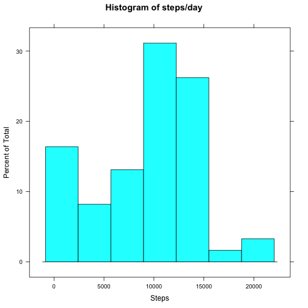
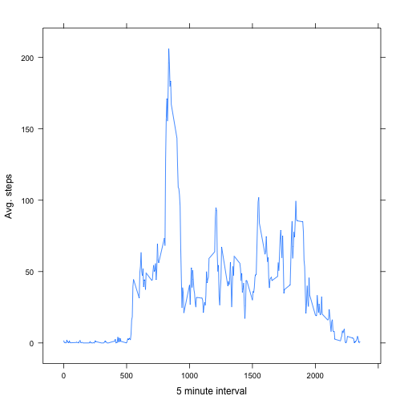
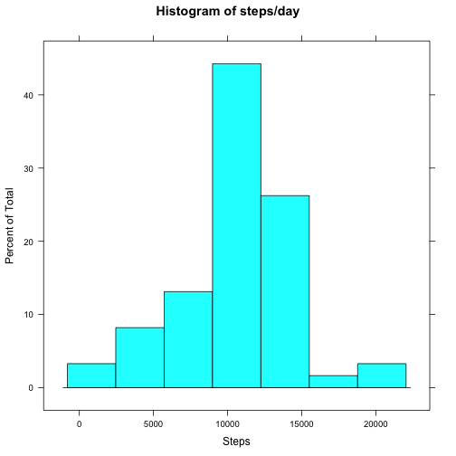
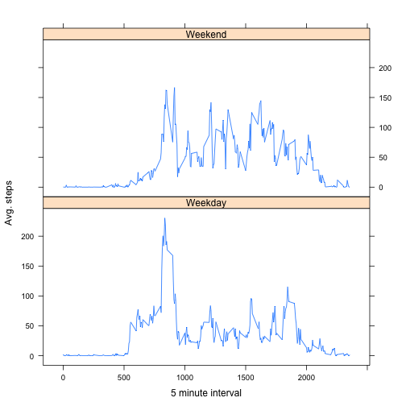

# Reproducible Research: Peer Assessment 1


## Loading and preprocessing the data


```r
library(lattice)
zip <- 'activity.zip'
activity <- read.csv(unz(zip, 'activity.csv'))
daily <- aggregate(activity['steps'], by=activity['date'], FUN='sum', na.rm=TRUE)
bySlice <- aggregate(activity['steps'], by=activity['interval'], FUN='mean', na.rm=TRUE)
```

## What is mean total number of steps taken per day?


```r
histogram(daily$steps, main='Histogram of steps/day', xlab='Steps')
```

 

```r
mean(daily$steps)
```

```
## [1] 9354
```

```r
median(daily$steps)
```

```
## [1] 10395
```

## What is the average daily activity pattern?


```r
xyplot(bySlice$steps ~ bySlice$interval, type='l', xlab='5 minute interval', ylab='Avg. steps')
```

 

```r
bySlice$interval[which.max(bySlice$steps)]
```

```
## [1] 835
```

## Imputing missing values

I will take the average value for each time slot to replace the missing data.


```r
impute <- activity
cc <- complete.cases(activity)
sum(! cc)
```

```
## [1] 2304
```

```r
for (i in which(!cc)) {
  ti <- impute[i,'interval']
  impute[i,'steps'] <- bySlice[bySlice$interval == ti, 'steps']
}
dailyI <- aggregate(impute['steps'], by=impute['date'], FUN='sum')
histogram(dailyI$steps, main='Histogram of steps/day', xlab='Steps')
```

 

```r
mean(dailyI$steps)
```

```
## [1] 10766
```

```r
median(dailyI$steps)
```

```
## [1] 10766
```

## Are there differences in activity patterns between weekdays and weekends?


```r
impute$weekday <- factor(ifelse(weekdays(as.POSIXct(impute$date)) %in% c("Saturday","Sunday"),
                                "Weekend", "Weekday"))
byDay <- aggregate(impute['steps'], by=c(impute['interval'], impute['weekday']), FUN='mean')
xyplot(byDay$steps ~ byDay$interval | byDay$weekday, type='l', xlab='5 minute interval',
       ylab='Avg. steps', layout=c(1,2))
```

 

